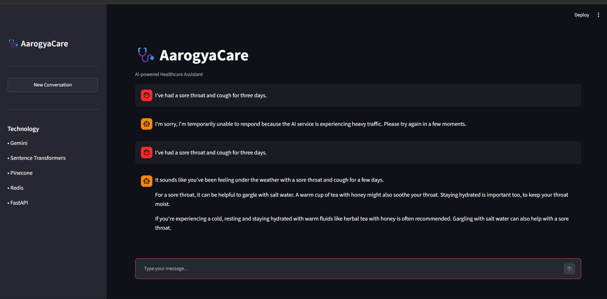
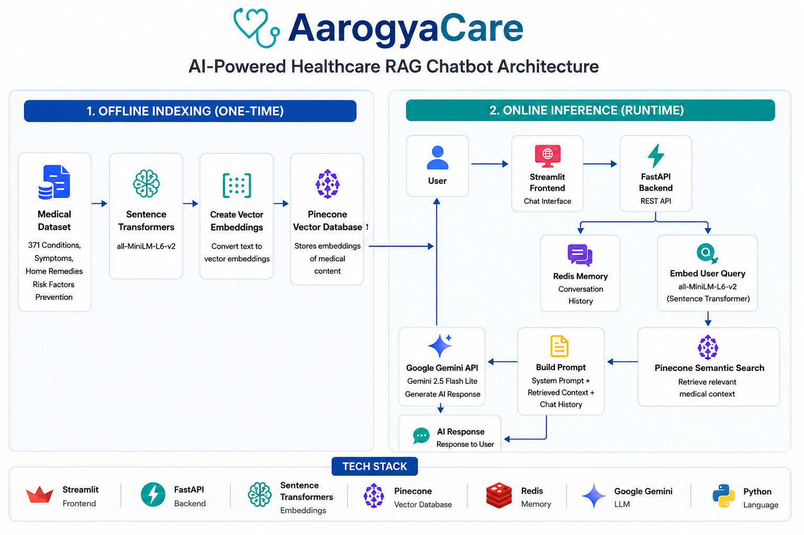

# AarogyaCare – AI-Powered Healthcare RAG Chatbot

AarogyaCare is a Retrieval-Augmented Generation (RAG) based healthcare chatbot that provides contextual information about medical conditions using a curated medical knowledge base. Instead of relying solely on a Large Language Model, the chatbot retrieves relevant medical information through semantic search and combines it with Google's Gemini model to generate accurate, natural, and context-aware responses.

---

## Live Demo

| Service | Link |
|----------|------|
| Application | *Coming Soon* |
| API Documentation | *Coming Soon* |

---

# Application



---

# System Architecture



---

# Project Overview

AarogyaCare is designed to demonstrate how Retrieval-Augmented Generation can be applied to healthcare applications. The chatbot retrieves relevant medical information from a vector database before generating a response, reducing hallucinations and improving the relevance of generated answers.

The project combines semantic search, vector embeddings, conversational memory, and large language models into a modular architecture capable of handling natural language healthcare queries.

The chatbot maintains conversation history using Redis, allowing users to ask follow-up questions while preserving context throughout the conversation.

---

# Features

- Retrieval-Augmented Generation (RAG)
- Semantic search using vector embeddings
- Context-aware conversations with Redis memory
- Medical knowledge base containing 371 curated medical conditions
- Natural language response generation using Google Gemini
- FastAPI REST API backend
- Interactive Streamlit web application
- Pinecone vector database for semantic retrieval
- Local embedding generation using Sentence Transformers
- Modular and scalable architecture

---

# Tech Stack

| Category | Technology |
|-----------|------------|
| Programming Language | Python |
| Frontend | Streamlit |
| Backend | FastAPI |
| Large Language Model | Google Gemini 2.5 Flash Lite |
| Embedding Model | sentence-transformers/all-MiniLM-L6-v2 |
| Vector Database | Pinecone |
| Conversation Memory | Redis |
| Data Processing | Pandas |
| API Documentation | Swagger UI |

---

# How It Works

The chatbot operates in two stages.

## Offline Indexing

The medical dataset is first cleaned and processed. Each medical condition is converted into vector embeddings using the Sentence Transformers model. These embeddings are then stored in Pinecone, creating a searchable vector database that serves as the chatbot's knowledge base.

## Online Inference

When a user submits a query, the application follows these steps:

1. The user sends a query through the Streamlit interface.
2. FastAPI receives and processes the request.
3. Previous conversation history is retrieved from Redis.
4. The user query is converted into an embedding.
5. Pinecone performs semantic similarity search.
6. The most relevant medical context is retrieved.
7. The retrieved context, conversation history, and system prompt are combined.
8. Google Gemini generates a contextual response.
9. The generated response is returned to the user.

---

# Medical Knowledge Base

The chatbot retrieves responses from a curated medical dataset consisting of:

- 371 Medical Conditions
- Symptoms
- Home Remedies
- Risk Factors
- Prevention Guidelines

Each medical document is embedded using Sentence Transformers and indexed in Pinecone to enable semantic retrieval based on meaning rather than keyword matching.

---

# Project Structure

```text
AarogyaCare-RAG/
│
├── assets/
│
├── chatbot/
│   ├── config.py
│   ├── embeddings.py
│   ├── memory.py
│   ├── prompts.py
│   ├── rag.py
│   ├── retriever.py
│   └── __init__.py
│
├── data/
│
├── notebooks/
│
├── screenshots/
│   ├── app.png
│   └── architecture.png
│
├── app.py
├── server.py
├── requirements.txt
├── README.md
└── .gitignore
```

---

# Key Highlights

- Retrieval-Augmented Generation architecture
- Semantic search instead of keyword matching
- Conversation memory using Redis
- Local embedding generation using Sentence Transformers
- Pinecone vector database for efficient document retrieval
- Google Gemini for natural language generation
- Modular backend architecture built with FastAPI
- Interactive frontend developed using Streamlit

---

# Future Enhancements

- Voice-based interaction
- Hybrid retrieval fallback for out-of-knowledge queries
- Multilingual support
- Medical document upload
- User authentication
- Conversation export
- Doctor recommendation module
- Cloud-native deployment with CI/CD

---

# Disclaimer

This chatbot provides general healthcare information retrieved from its indexed medical knowledge base. It is intended for educational and informational purposes only and should not be considered a substitute for professional medical advice, diagnosis, or treatment.

---

# Author

**Affaan Arbani**